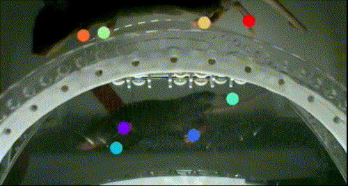

# Kine Wheel Arena – DLC

*Kine Wheel Arena – DLC* is an open-source experimental setup for markerless paw tracking of head-fixed mice running on a wheel.
The apparatus is based on the open-source motion tracking system [(KineMouse Wheel)](https://hackaday.io/project/160744-kinemouse-wheel) designed by [Richard Warren](https://richard-warren.github.io/). It has been extended with a camera, lighting, and a controller to run both in synchronization.
Tracking is done using a Deep Neural Network trained with [DeepLabCut](https://www.mackenziemathislab.org/deeplabcut) (DLC). The system is available for purchase at [LABmaker](https://www.labmaker.org/).

*Figure 1 – Video clip showing mouse paws annotated by Deep Neural Network.*

## Documentation

The full project documentation can be found on ReadTheDocs: [KineWheelSystem Docs](https://kinewheelsystem.readthedocs.io/en/latest/)

## License

This project is licensed under the GNU General Public License v3.0.
Note that the software is provided "as is", without warranty of any kind, express or implied.
If you use the code or data, please cite us!
